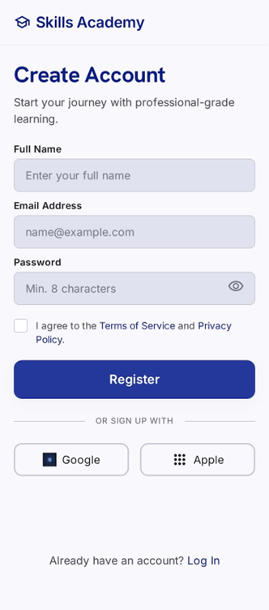
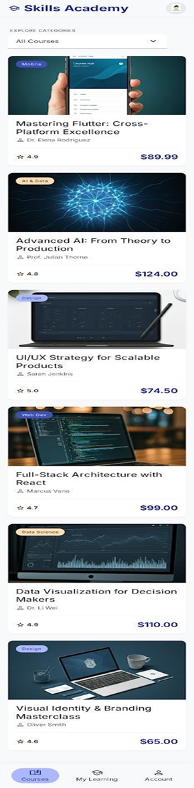
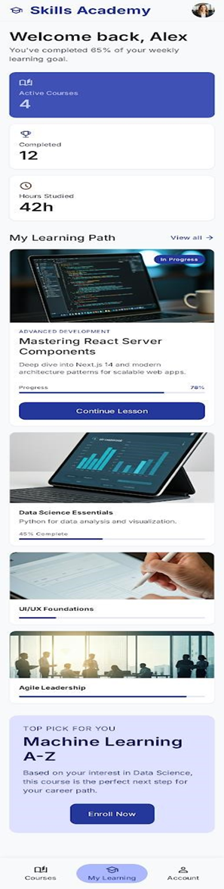
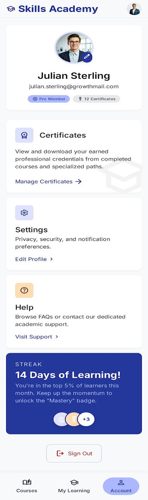
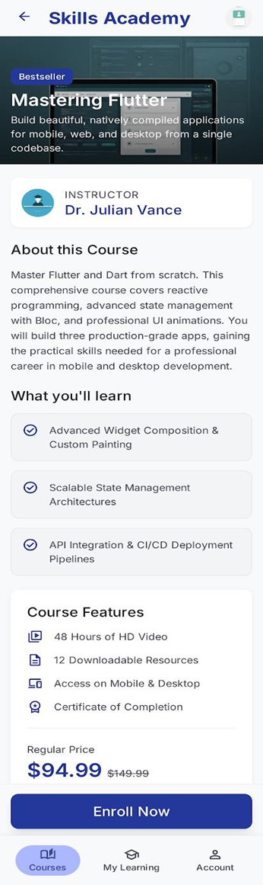

# 📘 Skills Academy – Flutter Beginner Task 5

A simple e‑learning application built using **Flutter**, designed as part of the Skills Academy training program.  
This project focuses on practicing **BottomNavigationBar**, **DropdownMenu**, and **Navigator (Routing)**.

---

## 🎯 Objective
The goal of this assignment is to implement a multi‑screen Flutter app with:
- Authentication flow  
- Bottom navigation  
- Dropdown actions  
- Screen routing  
- Data passing between screens  

---

## 🚀 Features

### 1️⃣ Authentication Flow
- First screen shown on app start.
- Includes:
  - Full Name field  
  - Email field  
  - Password field  
  - Terms & Conditions checkbox  
  - Register button  
- On register → navigates to the main app using  
  `Navigator.pushReplacement()`.

---

### 2️⃣ Main Navigation (BottomNavigationBar)
The app contains **4 main screens**:

| Index | Screen Name        | Description |
|-------|---------------------|-------------|
| 0     | Register Screen     | Authentication page |
| 1     | Courses Screen      | Main page with course list + dropdown |
| 2     | My Learning Screen  | Joined courses + progress |
| 3     | Account Screen      | User profile page |

---

### 3️⃣ Courses Screen (Dropdown Actions)
A `DropdownMenu` with 3 options:

#### 🔹 **All Courses**
Displays all available courses.

#### 🔹 **IT Course**
Shows a SnackBar: Welcome to IT Academy!

You are free to design this page — a simple offers layout was implemented.

---

### 4️⃣ Course Details & Data Passing
- The Courses screen displays a list of course cards.
- Each card contains:
  - Course title  
  - Instructor name  
- On tap → navigates to **CourseDetailsScreen**.
- Uses `Navigator.push()` and passes:
  - `courseTitle`
  - `instructorName`

These values are displayed on the details page.

---

## 🎨 UI & Theme
The app follows the required color palette:

| Purpose | Color |
|---------|--------|
| Primary | `0xFF24389C` |
| Secondary | `0xFFABB7FF` |

Clean, simple, and beginner‑friendly UI.

---

## 📱 Screenshots

### Register Screen

### Courses Screen

### My Learning Screen

### Account

### Details

---

## 👤 Author
**Nady Al‑Wazzeh**  
Flutter Developer – Skills Academy Training Program  